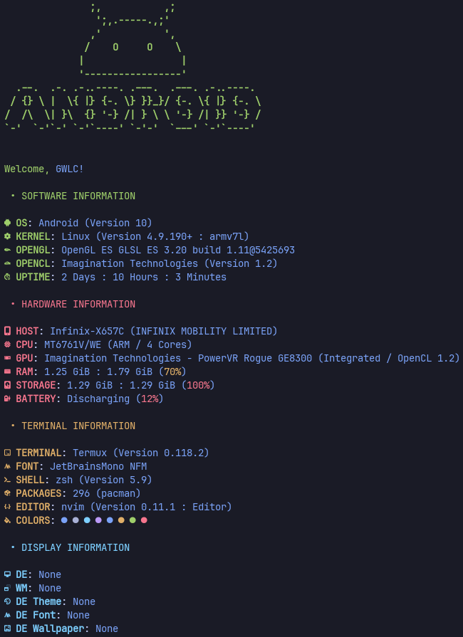

# What is This?

This is just my Configuration file for [Fastfetch](https://github.com/fastfetch-cli/fastfetch/).. that't it.



To Install It:

1. Make sure you already install Fastfetch:

```bash
pkg in fastfetch
```

2. Then, clone this Repo:

```bash
git clone https://github.com/GWLGT/My-Termux-Fastfetch-Configuration.git ~/.config/fastfetch
```

3. That's it, just run `fasfetch`, and you good to go **(See Note Below)**

# Note

1. If you have Mesa Package installed, make sure to put `LD_LIBRARY_PATH="/vendor/<arch-lib>:/system/<arch-lib>"` **(change `<arch-lib>` to folder based on your CPU Bit, e.g, `lib/` for 32 Bit, `lib64/` for 64 Bit)**, so the command becomes:

```bash
LD_LIBRARY_PATH="/vendor/<arch-lib>:/system/<arch-lib>" fastfetch
```

If you don't, Fastfetch will fetch **Wrong** OpenGL/OpenCL and your GPU Information.

2. And, make sure to Put this Code in your Shell rc file:

```bash
export USER="GWLC" # Change this to your own Name

if [[ -n "$DISPLAY" ]]; then
  export WM="Openbox" # Change to your Window Manager Name
  export DE="None" # Change to your Desktop Environment Name
  export DET="Slot Dark (Kvantum)" # Change to your DE/WM Theme
  export DEF="DejaVu Sans" # Change to your DE/WM Font Name
  export DEW="$HOME/.wallpaper/Cosmos-planets-Universe.jpg" # Change to your DE/WM Wallpaper Path
else
  export WM="None"
  export DE="None"
  export DET="None"
  export DEF="None"
  export DEW="None"
fi
```

so the Last Section of the Fastfetch Output show Correct Information.

4. Also, at Line 141 in the "format" section, change `pacman` in the `{pacman}`
and `(pacman)` to `{pkg}` and `(pkg)` if you're using `pkg` as your Termux Native
Package manager instead of `pacman`.

5. Lastly, make sure that you are using Nerd Font Icons ([Download Here](https://www.nerdfonts.com/font-downloads)), so the icons
will show up correctly.

Replace `font.ttf` from `~/.termux/font.ttf` with Nerd Font of your Choice.
